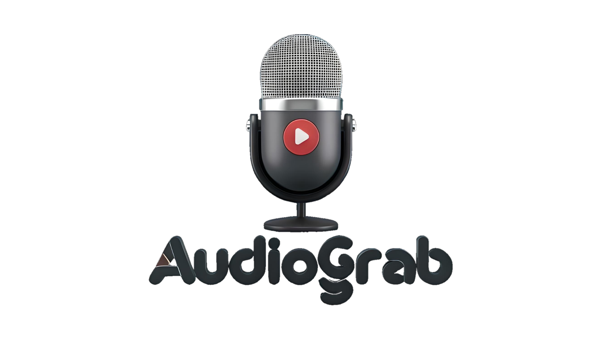

<br/>

<h4 align="center">A simple audio grabber for windows, linux, mac, and raspberry pi.</h6>
<p align="center">

 

 
 

<a href="https://discord.gg/luppux" target="_blank"> 
 
</a>
<a href="https://www.buymeacoffee.com/beykant" target="_blank">

</a>
</p>


## Installation

Using npm:
```shell
$ npm install audiograb
```

Other Installations:

```bash
$ yarn add audiograb
```

```bash
$ pnpm add audiograb
```

## Usage
```js
import { Recorder, EventType } from 'audiograb';
import fs from 'fs';

const recorder = new Recorder({
    '-i': 'Microphone (5- USB PnP Sound Device)',
}).setFormat('dshow');

// Create a `WriteStream` to save the audio data to a temporary file
const outputFilePath = './output.mp3';
const outputFile = fs.createWriteStream(outputFilePath);

// When recording starts
recorder.on('recordStarted', () => {
    console.log('Recording started...');
});

// Write audio data to the file as it arrives
recorder.on('audioData', (data) => {
    outputFile.write(data);
});

// When recording stops or an error occurs
recorder.on('recordStopped', () => {
    console.log('Recording stopped.');
    outputFile.end(); // Close the file stream
});

recorder.on('ffmpegInformation', (info) => {
    console.error('FFmpeg:', info);
});

// Start recording
recorder.start();

// Stop recording after a certain period
setTimeout(() => {
    recorder.stop();
}, 10000); // Stop recording after 10 seconds
```

## License

audiograb is licensed under the **GPL 3.0** License. See the [LICENSE](./LICENSE.md) file for details.

## Support

[](https://discord.gg/luppux)